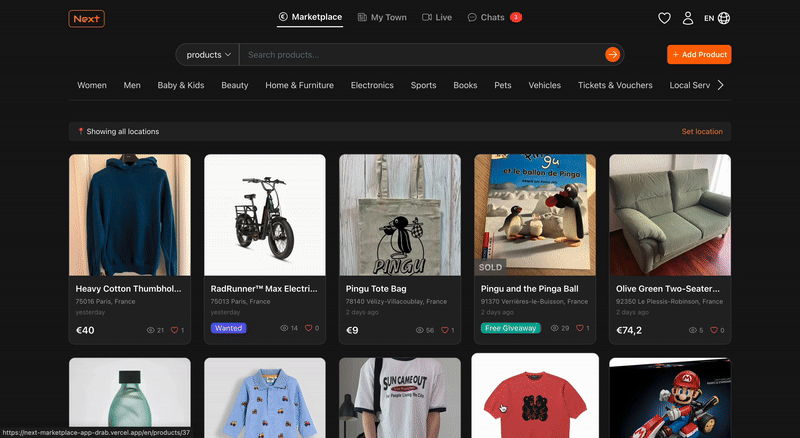
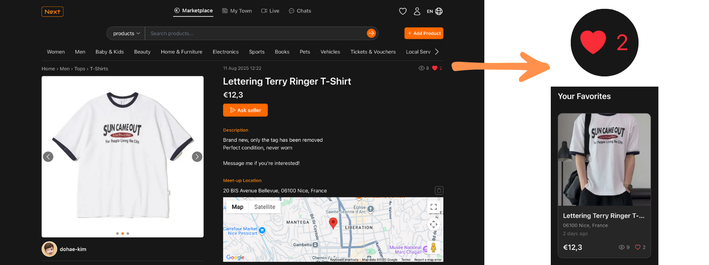
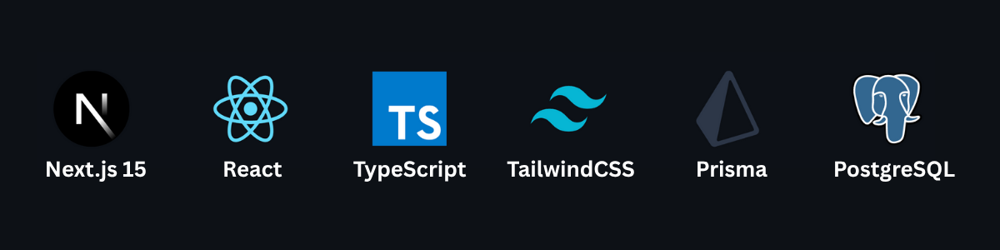
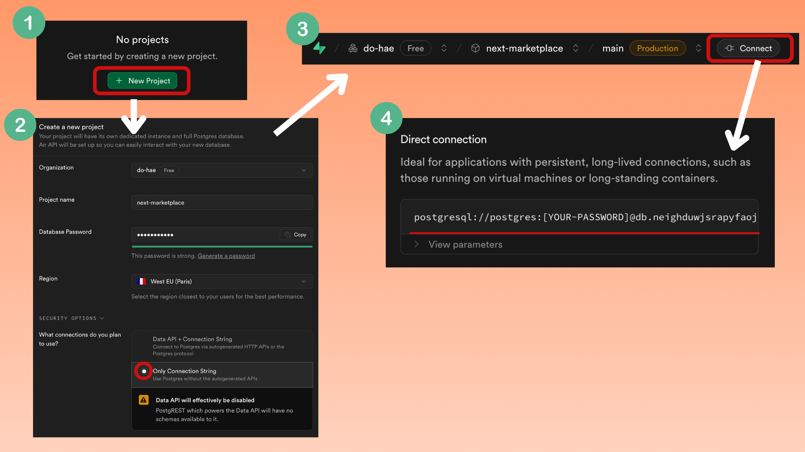

## 

> **Location-based community marketplace** where users can buy & sell locally, chat in real-time, stream live events, and contribute to a safer, more connected neighborhood economy.

## Live Demo

- [🚀 View Live](https://next-marketplace-app-drab.vercel.app/)

---

## 📜 Table of Contents

- [About the Project](#about-the-project)
- [Features](#-features)
- [Tech Stack](#tech-stack)
- [Project Structure](#project-structure)
- [Installation & Setup](#-installation--setup)
- [Technical Decisions & Highlights](#-technical-decisions--highlights)
- [Future Improvements](#-future-improvements)

---

## About the Project

This platform is designed to **reduce fraud in online transactions** by encouraging **face-to-face trades** with people nearby.

Currently, **address selection is limited to locations within France**, making the service localized and optimized for French communities.

Users can:

- Set a distance radius from their neighborhood to see only nearby listings
- Chat with buyers/sellers in **real-time**
- Broadcast themselves via **live streaming** for promotions, product showcases, or community events
- Interact in multiple languages (**English** & **French**) to make the platform more inclusive

The goal is to make **local commerce safer, more personal, and more community-oriented**.

---

## ✨ Features

### - Marketplace

- **Location-based filtering (France only)** – Browse items within a custom radius from your selected French address
  
  <br>
- **Item likes** – Save favorite items to your personal list
  
  <br>
- **Safe transactions** – A deal is only marked as complete when **both buyer and seller confirm**
- **Post-trade reviews** – Both parties can leave feedback after confirming the deal
- **Responsive design** – Works seamlessly on mobile and desktop

### - Real-time Communication

- **Instant chat** – Built with **Supabase Realtime** for low-latency messaging

### - Live Streaming

- **User-hosted live events** – Sellers can showcase products in real-time.  
  This feature can be used not only for selling products but also for promoting local shops, advertising neighborhood events, or hosting interactive community activities.

### - Multi-language Support

- **English & French** – Implemented via `next-intl`

### - Media Handling

- **Image uploads** – All user-uploaded images are stored securely via **Cloudflare**

### - Authentication

- **Google & GitHub OAuth** – Simple, secure sign-up & login process

---

## Tech Stack

## 

---

## Project Structure

```bash
📁
├── app/                         # Next.js App Router
│   ├── [locale]/                # Locale-aware routing (English / French)
│   ├── (auth)/                  # Authentication routes (login, signup, OAuth)
│   ├── (headers)/               # Header components/layout group
│   ├── (tabs)/                  # Tab-based navigation group
│   ├── profile/                 # User profile pages
│   ├── reviews/                 # Review pages
│   ├── layout.tsx               # Root layout
│   ├── page.tsx                 # Root page
│   └── api/                     # Serverless API routes
│       ├── github/              # GitHub OAuth endpoint
│       └── google/              # Google OAuth endpoint
│
├── components/                  # Reusable UI components
├── constants/                   # Constant values (categories)
├── i18n/                         # Internationalization configuration (next-intl setup)
├── lib/                         # Utilities and helpers (DB, auth, etc.)
├── messages/                    # Language-specific translation files
├── prisma/                      # Prisma schema and seed files
├── public/                      # Static assets (icons, images, etc.)
├── screenshots/                 # Project screenshots for documentation
│
├── middleware.ts                # Global middleware (locale handling, auth checks)
├── globals.css                  # Global styles (Tailwind base styles)
├── next.config.ts               # Next.js configuration
├── eslint.config.mjs            # ESLint configuration
├── .env/.env.development.local  # Environment variables
└── package.json                 # Scripts and dependencies
```

---

## ⚙ Installation & Setup

Follow these steps to run the project locally.

Copy and paste the commands below into your terminal to set up and run the project.

### 1. Download the Project

```bash
git clone https://github.com/dohae-kim22/next-marketplace-app.git
cd next-marketplace-app
```

### 2. Install Dependencies

Installs all the tools and libraries the project needs to run.

```bash
npm install
```

### 3. Set Up Environment Variables

Before running the project, you must create a `.env` file in the project root with the required keys.

---

#### **1. Create your `.env` file**

Copy the example environment file:

```bash
cp .env.example .env
```

> This command copies the example environment file (`.env.example`) to a new file named `.env`.  
> The `.env` file will be used by the app during development.

---

#### **2. Fill in your environment variables**

1. Open the `.env` file in your code editor.
2. Replace each placeholder value (e.g., `your_xxx`) with your actual keys.

> 💡 All the instructions for obtaining these keys are provided below.

---

#### 📍 Environment Variables Guide

| Variable(s)                                                                                                                                                | Required?   | Purpose / Usage                                                                            | How to Obtain                                                                                                                                                                                                                                                                                                                                                                                                                                                                                                                                                                                                                                                       |
| ---------------------------------------------------------------------------------------------------------------------------------------------------------- | ----------- | ------------------------------------------------------------------------------------------ | ------------------------------------------------------------------------------------------------------------------------------------------------------------------------------------------------------------------------------------------------------------------------------------------------------------------------------------------------------------------------------------------------------------------------------------------------------------------------------------------------------------------------------------------------------------------------------------------------------------------------------------------------------------------- |
| `PRISMA_DATABASE_URL` / `NEXT_PUBLIC_SUPABASE_URL` / `NEXT_PUBLIC_SUPABASE_PUBLIC_API_KEY`                                                                 | ✅ Yes      | **Database connection** & **Realtime chat**                                                | 1. Sign up at [Supabase](https://supabase.com/) and create a **Free Plan** project.<br>2. Once the project is ready, click **Connect** at the top.<br>3. In **Direct Connection**, copy the connection string and replace `password` with your actual DB password → `PRISMA_DATABASE_URL`.<br>4. Go to **Project Settings → Data API**.<br>5. Copy **Project URL** → `NEXT_PUBLIC_SUPABASE_URL`.<br>6. Go to **API Keys**, copy the **anon public** key → `NEXT_PUBLIC_SUPABASE_PUBLIC_API_KEY`.                                                                                                                                                                    |
| `COOKIE_PASSWORD`                                                                                                                                          | ✅ Yes      | **Encrypts session cookies** for secure authentication.                                    | Generate a secure random string (32+ characters) via [GeneratePassword.org](https://generatepassword.org).                                                                                                                                                                                                                                                                                                                                                                                                                                                                                                                                                          |
| `GITHUB_CLIENT_ID` / `GITHUB_CLIENT_SECRET`                                                                                                                | ⚠️ Optional | Enables **GitHub OAuth login**.                                                            | Go to [GitHub Developer Settings](https://github.com/settings/developers) → **OAuth Apps** → **Register a new application**.<br>**Homepage URL:** `http://localhost:3000/login`<br>**Authorization callback URL:** `http://localhost:3000/api/github/complete`<br>Copy the **Client ID** → `GITHUB_CLIENT_ID`.<br>Click **Generate new client secret**, copy it → `GITHUB_CLIENT_SECRET`.                                                                                                                                                                                                                                                                           |
| `GOOGLE_CLIENT_ID` / `GOOGLE_CLIENT_SECRET` / `GOOGLE_REDIRECT_URI`                                                                                        | ⚠️ Optional | Enables **Google OAuth login**.                                                            | Go to [Google Cloud Console](https://console.cloud.google.com/).<br>1. Create a new project if needed.<br>2. **APIs & Services → OAuth consent screen** → Configure (External).<br>3. **APIs & Services → Credentials** → **Create Credentials → OAuth Client ID**.<br>4. **Application type:** Web application<br>5. **Authorized JavaScript origins:** `http://localhost:3000`<br>6. **Authorized redirect URIs:** `http://localhost:3000/api/google/complete`<br>7. Copy **Client ID** → `GOOGLE_CLIENT_ID`. <br>8. Copy **Client Secret** → `GOOGLE_CLIENT_SECRET`.<br>9. Set `GOOGLE_REDIRECT_URI` to `http://localhost:3000/api/google/complete`.             |
| `CLOUDFLARE_API_KEY` / `CLOUDFLARE_ACCOUNT_ID` / `CLOUDFLARE_ACCOUNT_HASH` / `NEXT_PUBLIC_CLOUDFLARE_IMAGE_DELIVERY_URL` / `NEXT_PUBLIC_CLOUDFLARE_DOMAIN` | ✅ Yes      | **Image & video uploads, live streaming**.                                                 | **Note:** Costs ~$5/month. If you don't want to pay, use the deployed version [here](https://next-marketplace-app-drab.vercel.app/).<br>1. Sign up at [Cloudflare](https://www.cloudflare.com/).<br>2. Go to **Images** → Copy:<br> - **Account ID** → `CLOUDFLARE_ACCOUNT_ID`<br> - **Account Hash** → `CLOUDFLARE_ACCOUNT_HASH`<br> - **Image Delivery URL** (remove `/<image_id>/<variant_name>`) →`NEXT_PUBLIC_CLOUDFLARE_IMAGE_DELIVERY_URL`<br>3. **Use API** → **Create Token** with _Read/Write to Cloudflare Stream and Images_ → Copy API Token → `CLOUDFLARE_API_KEY`.<br>4. **Stream** → Copy **Customer Subdomain** → `NEXT_PUBLIC_CLOUDFLARE_DOMAIN`. |
| `NEXT_PUBLIC_GOOGLE_MAPS_API_KEY`                                                                                                                          | ✅ Yes      | **Location-based features** – pick trade location, filter listings by distance, view maps. | Go to [Google Cloud Console](https://console.cloud.google.com/).<br>1. **APIs & Services → Library** → Enable:<br>• Maps JavaScript API<br>• Geocoding API<br>• Places API<br>• Places API (New)<br>2. **APIs & Services → Credentials** → **Create API Key**.<br>3. Copy the key → `NEXT_PUBLIC_GOOGLE_MAPS_API_KEY`.                                                                                                                                                                                                                                                                                                                                              |

#### \* How to get `PRISMA_DATABASE_URL` from Supabase

## 

0. **Sign up for Supabase** at [https://supabase.com](https://supabase.com) and choose the **Free Plan**.
1. **Create a New Project** from your dashboard.
2. Once the project is ready, click the **Connect** button at the top of the page.
3. In the popup, find the **Direct Connection** section.
4. **Copy the provided connection URL**.
5. Replace the `[YOUR-PASSWORD]` part of the URL with **your own database password** (set when creating the project). _Without the square brackets or it may cause errors!_
6. Paste the final URL into your `.env` file as:
   ```bash
   PRISMA_DATABASE_URL="your_direct_connection_url_with_password"
   ```

---

### 4. Prepare the database

```bash
npx prisma migrate dev
npm run db:seed
```

### 5. Start the development server

```bash
npm run dev
```

### 🎉 App will be running at http://localhost:3000 🎉

Open this link in your browser to view the app

---

## 🛠 Technical Decisions & Highlights

- **Next.js (App Router)** – Chosen for its hybrid rendering (SSR + SSG) capabilities, SEO benefits, and built-in API routes.
- **TypeScript** – Strong type safety, reducing runtime errors and improving maintainability.
- **Tailwind CSS** – Rapid UI development with utility-first styling and responsive design.
- **Responsive Design** – Fully optimized for mobile, tablet, and desktop.
- **Supabase Realtime** – Enables instant chat updates without manual refresh.
- **Prisma ORM** – Type-safe database queries and schema migrations.
- **Cloudflare Images & Stream** – Cost-effective and performant media storage and live streaming.
- **OAuth (Google & GitHub)** – Simple, secure authentication without managing passwords.
- **i18n (next-intl)** – Supports English and French for broader audience reach.
- **Security** – All secrets stored in environment variables and database queries validated with Zod.

---

## 🚀 Future Improvements

- **User-Generated Content Translation (powered by OpenAI API)** – Automatically translate user posts, product uploads, and chat messages into the viewer’s preferred language.
  <br>
- **Gamified Badge System** – Introduce badges and missions to encourage engagement and reward trustworthy behavior.  
  Examples: Complete 5 transactions with a 5-star rating to earn a "Top Seller" badge or post 10 verified listings to unlock a "Neighborhood Pro" badge.
  <br>
- **Expanded Location Filtering** – Support multiple countries and dynamic radius selection.
  <br>
- **Keyword-Based Alerts** – Allow users to define keywords for items they are interested in. Notify them when a new listing matches their keywords.
